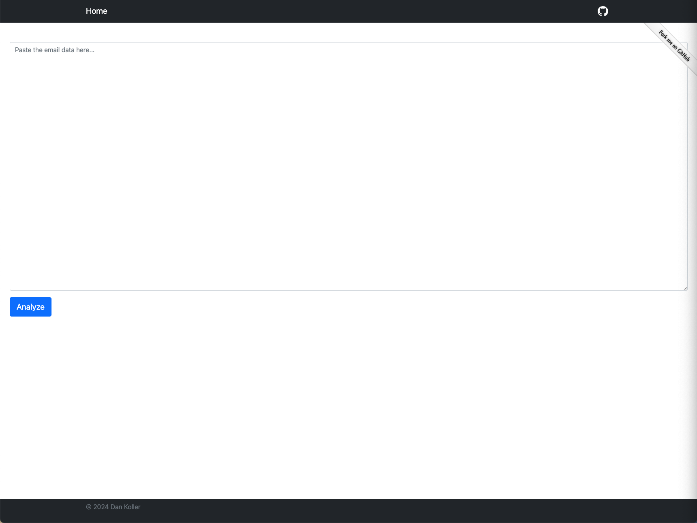
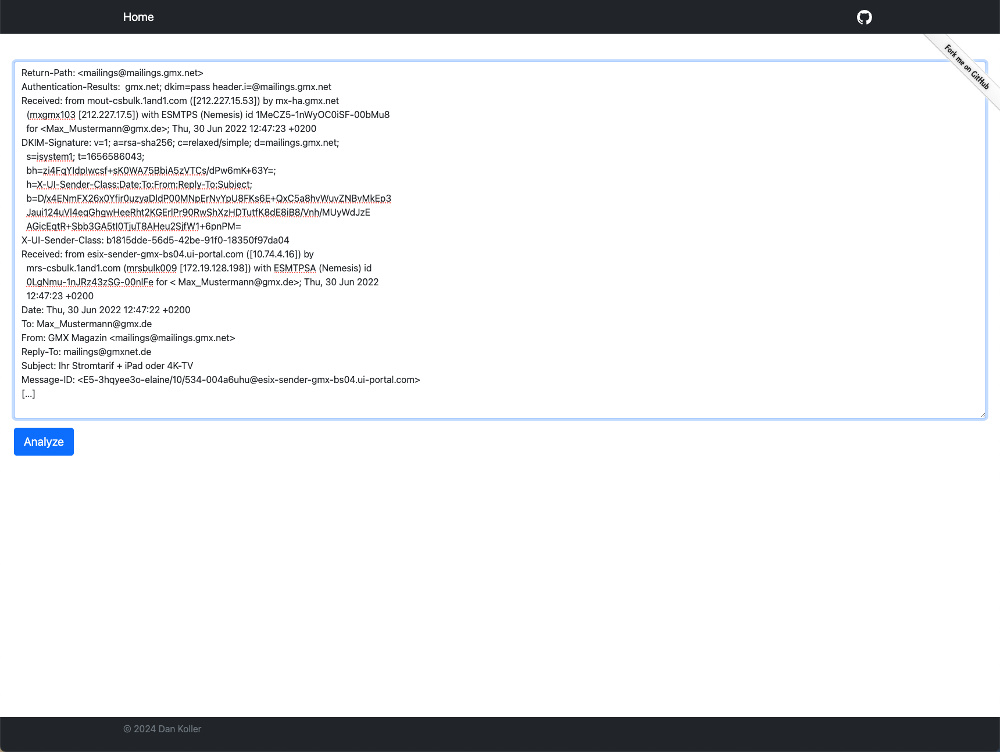
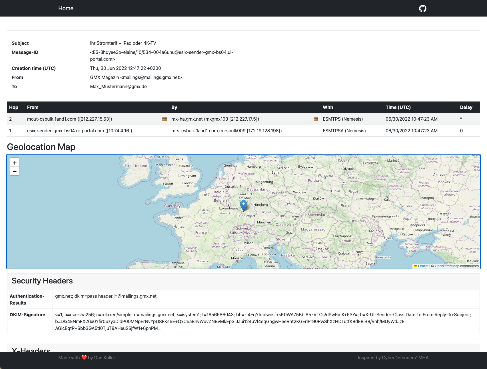

# User Guide

This document provides a guide to the user interface and functionality of the application. It also explains how to obtain the email data from different sources and what is possible and what is not possible with the application.

## Extracting email data

The application is designed to analyze (raw) email data. The best way to obtain this data is to copy the raw email data from your email client and paste it into the input field of the application. This way, the application can extract the necessary information and display it in a structured way.

To analyze email headers, they must first be extracted. The method for doing this varies depending on the web application or client. Below is a selection of these methods based on common web applications and clients. Here are some examples of common email clients and web applications:

1. **Outlook** (Local Client)

    - Double-click on an email message to open it outside the reading pane.
    - Click on `File` > `Properties`.
    - Header information will be displayed in the "Internet headers" field.
    - **Tip:** You can highlight the information in this field, press `CTRL+C` to copy it, and paste it into Notepad or Word to view the entire header at once.

2. **Thunderbird** (Local Client)

    - Select the email.
    - Go to `Settings` -> `View` -> `Message Source`.

3. **Web.de** (Web Application)

    - Click on the info icon of the email in question. A window with advanced email information will open.
    - Highlight the text by holding down the left mouse button and copy the highlighted text with `CTRL + C`.

4. **Gmx.de** (Web Application)

    - Click on the info icon of the email in question. A window with advanced email information will open.
    - Highlight the text by holding down the left mouse button and copy the highlighted text with `CTRL + C`.

5. **iCloud.com** (Web Application)

    - Select a message in "Mail" on iCloud.com.
    - Click on and then on "Show All Headers".
    - Click on and then on "Show Standard Headers" to stop displaying all headers.

6. **Gmail.com** (Web Application)

    - Open the email whose header you want to check.
    - Click on the three-dot menu next to "Reply" and select "Show Original".
    - Copy the text on the page.
    - Open the "Message Header" tool.
    - Paste your header in the "Paste Email Header Here" section.
    - Click on "Analyze Header" at the top.

### Example Email Header

To illustrate, below is an excerpt from the email header of a promotional email from the GMX platform (personal data has been anonymized here).

**Header:**

```
Return-Path: <mailings@mailings.gmx.net>
Authentication-Results:  gmx.net; dkim=pass header.i=@mailings.gmx.net
Received: from mout-csbulk.1and1.com ([212.227.15.53]) by mx-ha.gmx.net
  (mxgmx103 [212.227.17.5]) with ESMTPS (Nemesis) id 1MeCZ5-1nWyOC0iSF-00bMu8
  for <Max_Mustermann@gmx.de>; Thu, 30 Jun 2022 12:47:23 +0200
DKIM-Signature: v=1; a=rsa-sha256; c=relaxed/simple; d=mailings.gmx.net;
  s=isystem1; t=1656586043;
  bh=zi4FqYIdpIwcsf+sK0WA75BbiA5zVTCs/dPw6mK+63Y=;
  h=X-UI-Sender-Class:Date:To:From:Reply-To:Subject;
  b=D/x4ENmFX26x0Yfir0uzyaDldP00MNpErNvYpU8FKs6E+QxC5a8hvWuvZNBvMkEp3
  Jaui124uVl4eqGhgwHeeRht2KGErlPr90RwShXzHDTutfK8dE8iB8/Vnh/MUyWdJzE
  AGicEqtR+Sbb3GA5tI0TjuT8AHeu2SjfW1+6pnPM=
X-UI-Sender-Class: b1815dde-56d5-42be-91f0-18350f97da04
Received: from esix-sender-gmx-bs04.ui-portal.com ([10.74.4.16]) by
  mrs-csbulk.1and1.com (mrsbulk009 [172.19.128.198]) with ESMTPSA (Nemesis) id
  0LgNmu-1nJRz43zSG-00nlFe for < Max_Mustermann@gmx.de>; Thu, 30 Jun 2022
  12:47:23 +0200
Date: Thu, 30 Jun 2022 12:47:22 +0200
To: Max_Mustermann@gmx.de
From: GMX Magazin <mailings@mailings.gmx.net>
Reply-To: mailings@gmxnet.de
Subject: Ihr Stromtarif + iPad oder 4K-TV
Message-ID: <E5-3hqyee3o-elaine/10/534-004a6uhu@esix-sender-gmx-bs04.ui-portal.com>
[…]
```

## User Interface

The user interface of the application is divided into two main sections: the input section and the result section.

### Input Section

The input section is where you paste the email data you want to analyze. It consists of a text area where you can paste the email data and a button to start the analysis.




After pasting the email data, click the "Analyze" button to start the analysis. This may take a few seconds, depending on the size of the email data. A loading spinner will indicate that the analysis is in progress.

### Result Section



The result section displays the structured information extracted from the email data. It is divided into several tabs, each containing different types of information. The tabs are:

-   **Overview**: Basic information about the email, such as the subject, sender, and recipient.
-   **Hops**: The path the email took from the sender to the recipient.
-   **Geolocation**: The location of the sender and recipient (if available).
-   **Security Headers**: Information about the security features of the email.
-   **X-Headers**: Additional information extracted from the email headers.
-   **Other Headers**: Other headers that were extracted from the email.
-   **Content**: A chronological course of the email content (= messages).
-   **Attachments**: A list of attachments included in the email.

You can download the attachments directly from the application by clicking on the download button next to the attachment name. However, not all attachments can be downloaded directly from the application. In such cases, just the name of the attachment will be displayed.

## Limitations

The application is designed to analyze email data and extract useful information from it. However, there are some limitations to what the application can do:

-   **Attachments**: The application can only extract attachments that are included in the email data. If an attachment is not included in the email data, requires authentication, or is not publicly accessible, the application will not be able to download it.

## Notes

-   Attachments are prefixed with `mapy_YYYYMMDD_` to avoid naming conflicts. The original file name is appended to the prefix.

-   Attachments are stored temporarily on the server for the duration of the analysis. **Every hour**, the application will automatically clean up temporary files and data **that are older than one hour** that are no longer needed. If you need to keep an attachment for longer, you should download it before the cleanup process runs or re-analyze the email data.
